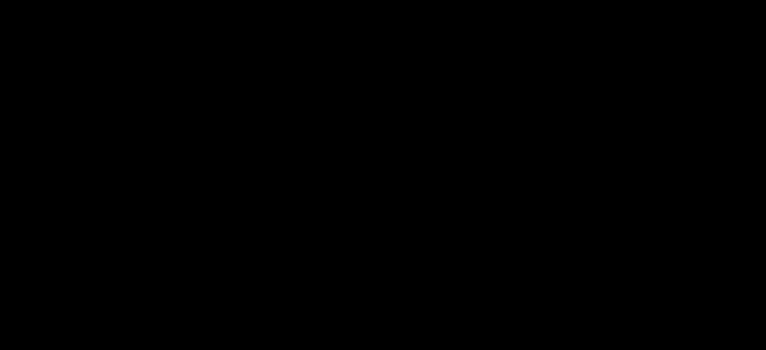

<!-- PROJECT LOGO -->
 

  <h1 align="center">Tilting Maze Game ✨</h1>

  

    Se configuro una escena Three.js simulando un laberinto en 3D con animaciones y controladores de eventos. Con esto se intento crear un videojuego de laberinto. URL / Demo: 
    <a href="http://alanmg.me/tiltingmaze/">alanmg.me/tiltingmaze/</a>
     
     
    <a href="http://alanmg.me/">Más sobre mi</a>
  

  <kbd>
    </img>
  </kbd>

Contácteme en alanfmorag@gmail.com si tiene comentarios o ideas para el sitio web. ¡Deja un ⭐ si te gusta!
